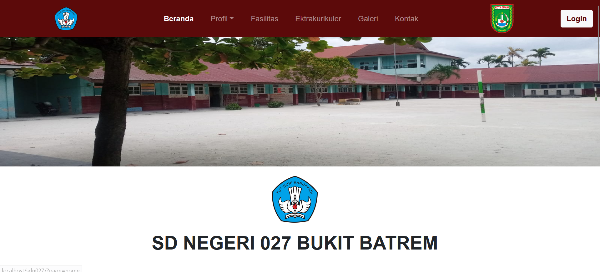
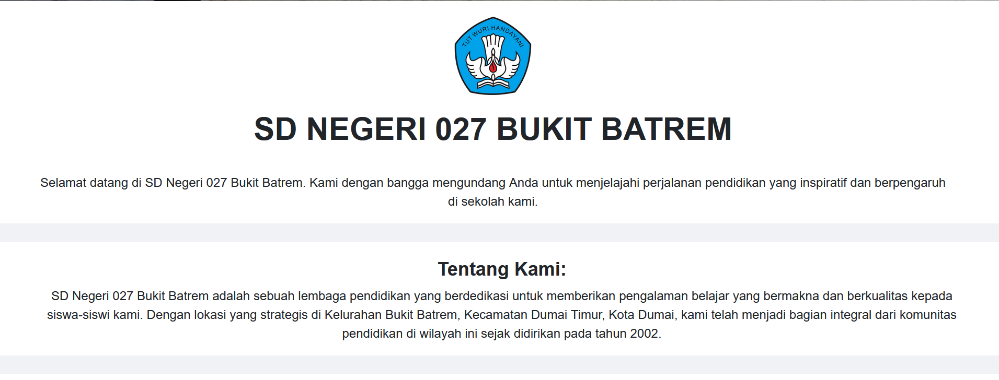
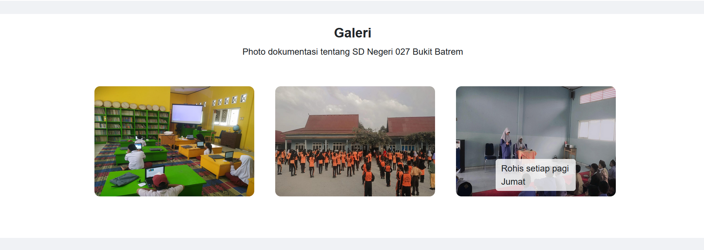
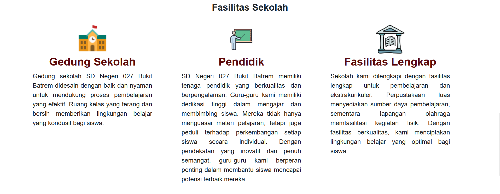
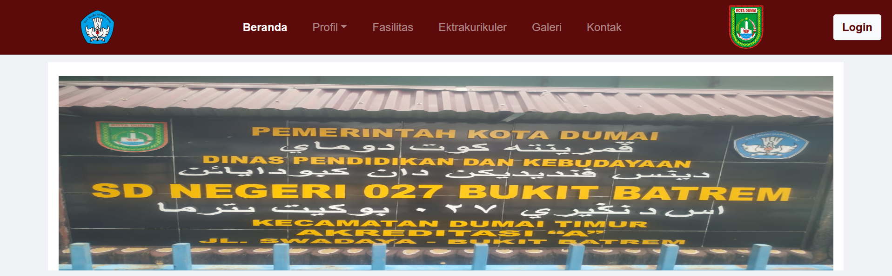
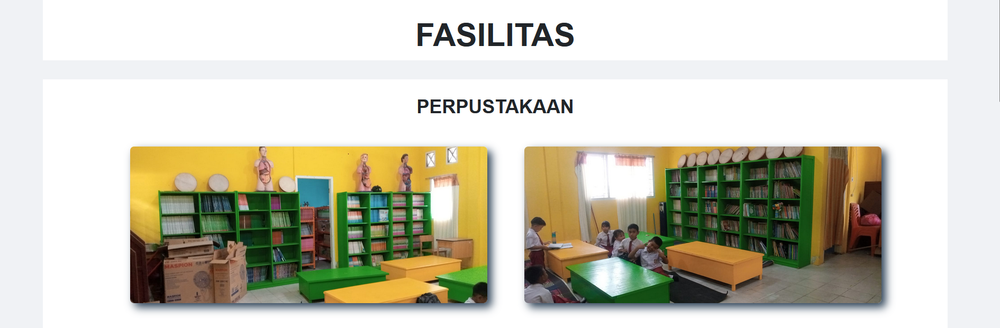
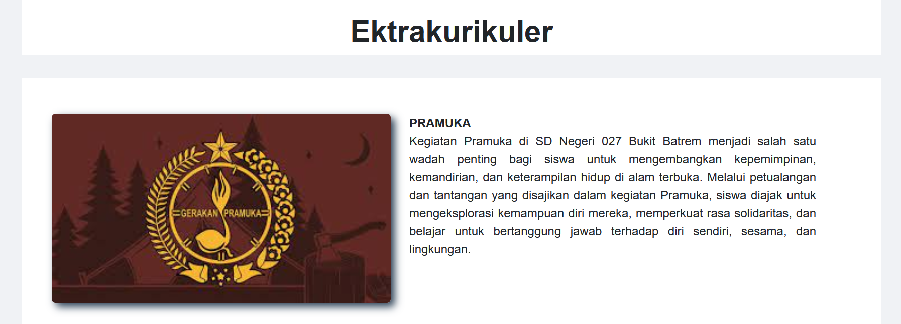
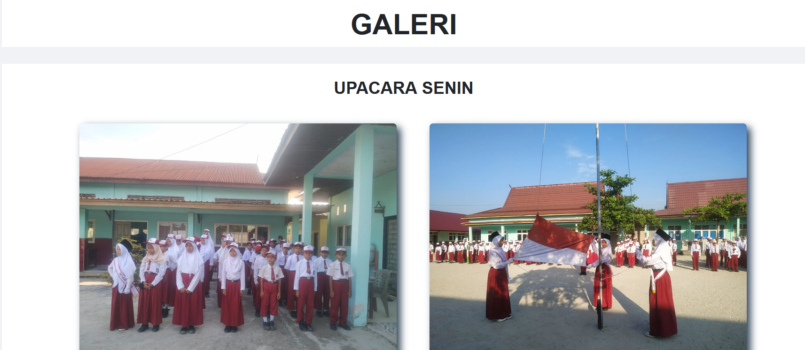
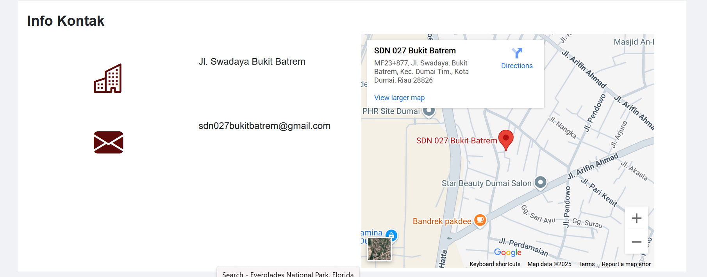

# Website Company Profile SDN 027 Bukit Batrem

Website ini dibuat sebagai bagian dari kerja praktik saya di SD Negeri 027 Bukit Batrem, Dumai, pada bulan Februari–Maret 2024. Proyek ini dikerjakan secara mandiri dalam waktu kurang dari 1 bulan.

## 🎯 Tujuan Proyek
Membuat website profil sekolah yang menampilkan informasi dasar sekolah, visi-misi, sejarah, struktur, ekstrakurikuler, galeri foto kegiatan, dan kontak yang dapat diakses publik.

## 🛠️ Teknologi yang Digunakan
- HTML
- CSS
- JavaScript
- PHP

## 🧩 Fitur Utama
- Halaman Beranda
- Informasi Profil Sekolah : Visi-Misi, Sejarah, Struktur
- Fasilitas
- Ekstrakurikuler
- Galeri Foto
- Kontak Sekolah

## 📸 Screenshots

, (ss/misi2.png), (ss/sejarah.png), (ss/struktur.png), (ss/struktur2.png)
, (ss/fasilitas2.png), (ss/fasilitas3.png), (ss/fasilitas4.png)
, (ss/ekstra2.png)
, (ss/galeri2.png), (ss/galeri3.png), (ss/galeri4.png)

## 📁 Struktur Folder

## ⚠️ Catatan
Website ini sebelumnya dihosting secara sementara, namun domain dan hosting saat ini telah nonaktif.

## 👤 Dibuat oleh
**Atikah Jamil** – Mahasiswi STT Dumai, Teknik Informatika  
